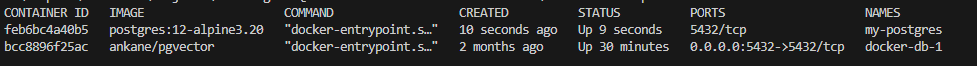
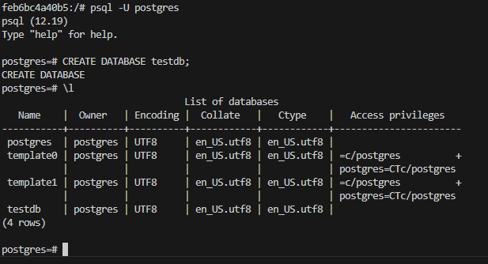

# PostgreSQL 12 with Alpine 3.20 Docker Container

This guide provides step-by-step instructions on how to create and run a Docker container for PostgreSQL 12 based on Alpine 3.20. The Dockerfile used is from the official Docker library.

## Prerequisites

- Docker installed on your system.
- Internet connection to pull the necessary images.

## Steps to Create the Docker Container

### 1. Dockerfile

First,we go where Dockerfile is stored, from  our terminal  

```sh
cd backend/docker/postgres/
```
IF you want another specific version of postgre to clone the specific file or download it directly.

```
git clone https://github.com/docker-library/postgres.git
cd postgres/12/alpine3.20
```

### 2. Build the Docker Image

Navigate to the directory containing the Dockerfile and build the Docker image.

```sh
docker build -t postgres:12-alpine3.20 .
```

This command builds the Docker image and tags it as `postgres:12-alpine3.20`.

### 3. Run the Docker Container

After building the image, you can run the Docker container with the following command:

```sh
docker run --name my-postgres -e POSTGRES_PASSWORD=mysecretpassword -d postgres:12-alpine3.20
```

- `--name my-postgres`: Names the container `my-postgres`.
- `-e POSTGRES_PASSWORD=mysecretpassword`: Sets the PostgreSQL password to `mysecretpassword`.
- `-d`: Runs the container in detached mode.
- `postgres:12-alpine3.20`: The name of the image to run.

### 4. Verify the Container is Running

To check if the container is running, use the following command:

```sh
docker ps
```

You should see the `my-postgres` container in the list of running containers.

## Testing the PostgreSQL Server

To ensure that the PostgreSQL server is working correctly, follow these steps:

### 1. Access the Container

First, get a shell into the running container:

```sh
docker exec -it my-postgres bash
```

### 2. Connect to PostgreSQL

Once inside the container, you can connect to the PostgreSQL server using the `psql` command-line tool:

```sh
psql -U postgres
```

### 3. Run a Simple SQL Command

Run a simple SQL command to ensure everything is working. For example, create a test database:

```sql
CREATE DATABASE testdb;
```

Check if the database was created successfully:

```sql
\l
```

You should see `testdb` listed among the databases.

### 4. Create a table test
```
CREATE TABLE demo_table (id SERIAL PRIMARY KEY, name VARCHAR(50), age INTEGER);
```

### 5. Insert data to table
```
INSERT INTO demo_table (name, age) VALUES ('Alice', 30), ('Bob', 25), ('Charlie', 35);
```

### 6. Display data

```
SELECT * FROM demo_table;
```


Now we are sure

### 4. Exit the PostgreSQL Shell and Container

To exit the PostgreSQL shell, type:

```sh
\q
```

Then exit the container shell:

```sh
exit
```

## Stopping and Removing the Container

If you need to stop the container, use:

```sh
docker stop my-postgres
```

To remove the container, use:

```sh
docker rm my-postgres
```

## Conclusion

You have successfully created and run a Docker container for PostgreSQL 12 based on Alpine 3.20. You also verified that the PostgreSQL server is working correctly by running a few simple commands. This setup can now be used for development and testing purposes.

